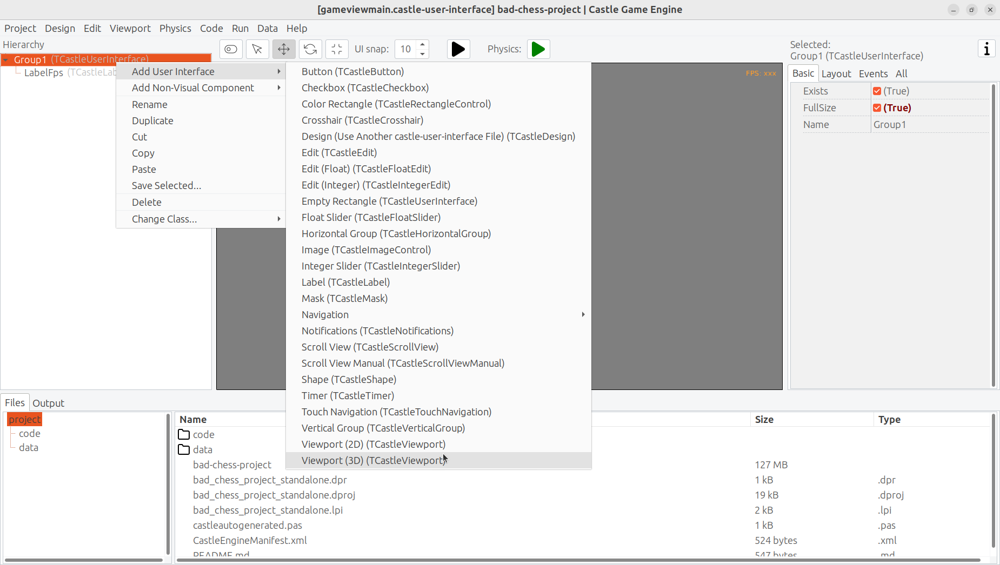
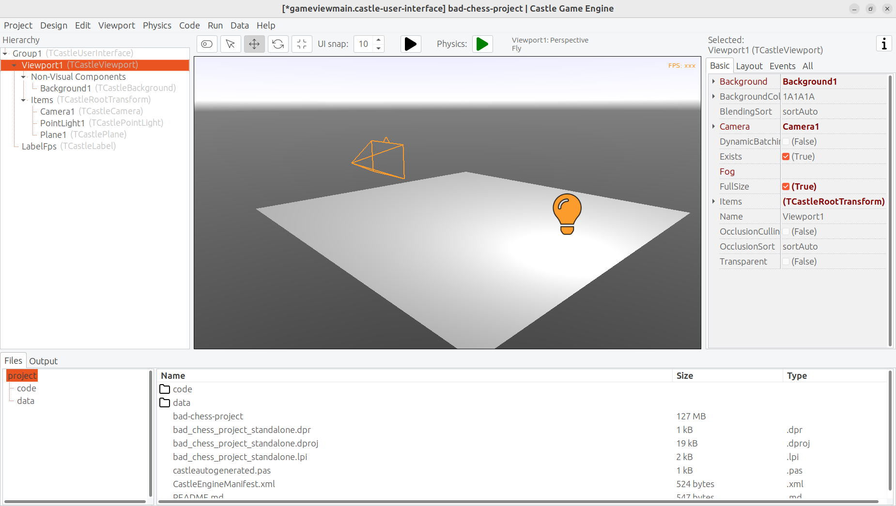

# The bad way to play chess: Implementing 3D physics fun using Castle Game Engine
Michalis Kamburelis
:toc: left
:toclevels: 4
:sectnums:
:source-highlighter: coderay
:docinfo1:

## Introduction

I remember my first book about chess when I was young. It was a book teaching young people how to play chess. The first chapter started with a tale about children _playing chess incorrectly_: they didn't know the rules, so they put chess pieces randomly on the chessboard, and flicked them with their fingers towards the other side. The wooden chess pieces flew in the air, bashed with each other. Eventually most of the chess pieces fell off the chessboard onto the floor. The person with last chess piece remaining on the chessboard was the winner.

That was naturally a bad way of playing chess. In the second chapter of the book, an adult came, told children that they play chess in a wrong way, and taught them the right way -- how each figure moves, how king is special, what it means to check and then mate your opponent. The book overall was great, and it's likely responsible for my love for chess (the _proper_ version of the game, with rules instead of flicking objects) to this day.

That being said... Don't you want to play some day this _"incorrect"_ version of chess, the children's version, where nothing else matters except just sending each chess piece flying toward the other side?

In this article we will go back in time, erase our hard-earned knowledge about how to _really_ play chess, and implement a simple 3D physics fun application where you can flick chess pieces using physics. You can treat it as a game for 2 people -- just play it on a computer, and let each player use the mouse and keyboard in turn.

## The Real Introduction

The real purpose of this article is to be an entertaining but also useful introduction to using _Castle Game Engine_.

_Castle Game Engine_ is a cross-platform (desktop, mobile, consoles) 3D and 2D game engine. In this article, we will learn how to make a game for desktops (Linux, Windows, macOS, FreeBSD). In future articles we'd like to show also development for other platforms (like Android and iOS) and future plans (web platform).

You can use FPC or Delphi to develop the application presented here. In our engine, we are committed to perfect support for both of these Pascal compilers. Though note that with Delphi, you can right now target only Windows (all the platforms are available with FPC).

_Castle Game Engine_ features a powerful visual editor to design your games, in 2D or 3D. Just like Delphi and Lazarus visual libraries, it's all based on a simple RAD concept: you can design a functional application easily visually but at the same time *everything you do is actually using Pascal classes and properties*. So all your knowledge gained from using the editor is also useful when you need to write some Pascal code, to do any non-trivial processing. You will use the same classes and properties in Pascal that you've seen in the visual editor.

The engine is free and open-source. Use it to develop open-source or proprietary applications. You can distribute them to friends in any way, you can publish them on Steam, Itch.io, Google Play (Android), AppStore (iOS), your own website -- everywhere.

## Download and install the engine

Start by downloading the engine from our website: `https://castle-engine.io/download` . Choose the version suitable for your operating system.

* On Windows, the download is a simple installer.

* On Linux, just unpack the downloaded zip file to any directory you like.

* Follow the website for more detailed instructions and other platforms.

Then the _Castle Game Engine_ editor.

* If you used the installer on Windows, then the shortcut to run _Castle Game Engine_ has already been created for you.

* If you unpacked the engine a zip file, then run the binary `castle-editor` from the subdirectory `bin` where you have unpacked the engine.

image::images/initial_editor.png[Castle Game Engine editor]

If you encounter any issue, consult our manual on `https://castle-engine.io/install` .

## Create your first project

Let's create a new project. Click on _"New Project"_ button, choose the _"Empty"_ as project template, configure the project name and directory as you wish, and click _"Create Project"_.

image::images/new_project.png[Creating new project]

In response, we will create a new directory with a few project files that determined your project data and initial Pascal code.

image::images/project_view.png[Project]

You can explore the files in your project using the bottom panel of the editor. You can also just explore them using your regular file manager -- there's nothing special about this directory, these are normal files and directories.

Some important files and directories:

- `code` is a subdirectory where we advise to put all Pascal source code (units) of your application. Initially it contains just 2 units, `GameInitialize` and `GameViewMain`.

- `data` is a subdirectory where you should put all the data that has to be loaded at run-time by your application. All the 3D and 2D models, textures, designs have to be placed here if you want to use them in your game. Initially it contains the _design_ called `gameviewmain.castle-user-interface` (and, less important, `CastleSettings.xml` and `README.txt` files).

The general idea is that the initial application (created from the _"Empty"_ template) contains just a single _view_ called `Main`. A _view_ is a _Castle Game Engine_ concept that represents something that can be displayed in a _Castle Game Engine_  application. You use it typically quite like a _form_ in Delphi or Lazarus, in that it is a basic way to organize your application.

- Every _view_ can be visually designed. Just double-click on it, in the _"Open Existing View"_ panel or in the _"Files"_ panel (when you're exploring the `data` subdirectory).
+
This allows to visually design the contents of the `gameviewmain.castle-user-interface` file. The file has an extension `.castle-user-interface` because a _view_ is a special case of _user interface_ in Castle Game Engine.
+
In larger applications, you can have multiple views. Also, in larger applications, you can visually design some _user interface_ elements that are not views, but are just reusable pieces of a user interface. All these files have the extension `.castle-user-interface` and can be visually designed using the editor. The views have, by convention, a name like `game*view.castle-user-interface`.

- Every view has also an accompanying Pascal unit. The unit is named like the view, but without the `.castle-user-interface` extension. So in our case, the unit is called `gameviewmain.pas`. The unit contains the Pascal code that should be executed when the view is displayed. It defines a class that has methods to react to view being open, and more events.

See `https://castle-engine.io/view_events` and `https://castle-engine.io/views` to learn more about the _views_ in our engine.

To be clear about the terminology used throughout our engine:

* A _design_ is a name for _a file you can visually design using our editor_. A design can be a file with extension
** `.castle-user-interface` (user interface, can be loaded to a class descending from `TCastleUserInterface`)
** `.castle-transform` (3D or 2D transformation, can be loaded to a class descending from `TCastleTransform`)
** `.castle-component` (any other component; can be loaded to a class descending from `TComponent`)

* A _user interface design_ is a specific case of a _design_ file. It is a file with `.castle-user-interface` extension.

* A _view_ is a specific case of a _user interface design_. By convention it is called like `game*view.castle-user-interface`.

You're probably itching to start actually _doing_ something after this lengthy introduction. Let's get to it.

As a first thing, make sure that everything works. Use the big _"Compile And Run"_ button and watch as the project is compiled and run. The result will be boring -- dark window with FPS (_frames per second_) counter in the top-right corner. FPS are a standard way to measure your application performance.

image::images/first_run.png[First run of the project]

## Optionally tweak the editor preferences

Once things work, you may want to tweak them by going to editor _"Preferences"_. In particular:

- The editor by default uses a bundled version of latest stable _FPC (Free Pascal Compiler)_. If you'd rather use your own _FPC_ installation or _Delphi_, configure it in the preferences.

- To edit the Pascal files, the editor by default tries to auto-detect various Pascal-capable  IDEs and editors, like _Lazarus_, _Delphi_, _Visual Studio Code_. If you prefer to configure a specific editor, choose it in the preferences.

More details about the editor configuration can be found in our manual on `https://castle-engine.io/install` .

The editor can use any Pascal compiler and any text editor. We deliberately don't put any special requirements on what you can use. Though we make sure to support the popular choices in a great way. In particular, we have a dedicated support for using _Visual Studio Code_ with Pascal (and _Castle Game Engine_ in particular), see `https://castle-engine.io/vscode` .

## Learning to design 3D items in a viewport

If you haven't already, open the `main` view in the editor.

You can double-click on it in the _"Open Existing View"_ panel or in the _"Files"_ panel (when you're exploring the `data` subdirectory).

The initial view is mostly empty.

- It has a root component `Group1`, which is an instance of `TCastleUserInterface`. This component will contain everything else we design.

- And it has a label `LabelFps` (an instance of `TCastleLabel` class). At run-time, this label will display the FPS counter.

Let's add more content to it. First of all, to display anything in 3D, you need a _viewport_. A viewport is a way to display 3D or 2D content. It is an instance of `TCastleViewport` class. Add it to the design by right-clicking on the `Group1` component and choosing _"Add User Interface -> Viewport (3D)"_ from the menu that appears.

The result should look like this:

image::images/view_viewport.png[View with a viewport]

Following this, drag the new `Viewport1` component above the `LabelFps`, so that the FPS counter is displayed in front of the viewport.

Now play around in the 3D view. There are 3 items:

- Camera, called just `Camera1`, determines what the user will actually see once the game is run.

- Light source makes things _lit_ (bright). The initial light source is called `PointLight1` and it is an instance of `TCastlePointLight`, which is a simple light that shines in all directions from a single 3D point.

- Rectangle representing a ground called a `Plane1`. Mathematically speaking, it's not a _plane_, it's a rectangle -- however calling this _"a plane"_ is a convention used by many 3D software.

Click and hold the _right mouse button_ over the viewport to look around. Use the keys AWSD to move. Use the mouse scroll to increase / decrease the movement speed.

Play around with **moving the items**. Drag the 3D axis to move any object.

Play around with **adding new 3D items**. Right-click on `Items` component inside the `Viewport1` and from the context menu add primitives like _"Box"_, _"Sphere"_, _"Cylinder"_. Move them around, delete them (with _Delete_ key), duplicate (with _Ctrl+D_ key).

Change some properties. On the right side, you can see an _object inspector_, familiar to any Lazarus and Delphi user. Adjust the properties, for example change the `Size` of the `Plane1` to be much bigger. Click on _"..."_ (3 dots) button at the _"Color"_ property of any primitive (like a plane, a box, a sphere...) to change the color.

If you get stuck, consult our manual, in particular `https://castle-engine.io/viewport_and_scenes` and `https://castle-engine.io/viewport_3d` may be helpful to learn basic 3D manipulation.

## Design a 3D chessboard with chess pieces

You can now design a 3D world composed from simple primitives, like boxes and spheres.

But this isn't a way to create realistic 3D graphics. In most 3D graphic applications, the content is created using a specialized 3D _authoring tool_, like _Blender_. 3D artist creates a _mesh_ (a set of vertexes, connected to form edges and polygons), assigns materials and textures, and exports the resulting object to a file that can be read by a game engine -- like a glTF file.

On _Castle Game Engine_ side, our most important component to display a 3D model is `TCastleScene`. It's a big component, playing central role in our engine (in one way or another, it is actually responsible for all of 3D and 2D rendering in our viewport). Using it is simple: you create an instance of `TCastleScene` and set its `URL`  property to point to the model you want to display. The `TCastleScene` class descends from the `TCastleTransform` class, and as such you can move, rotate and scale the `TCastleScene` instances. Alternatively, you can also drag-and-drop the 3D model from the _"Files"_ panel to the viewport, editor will then automatically create a `TCastleScene` instance that loads the given model.

We support a number of 3D and 2D model formats. They are listed on `https://castle-engine.io/creating_data_model_formats.php` . The short version is: use the glTF format.

If you are capable of creating your own 3D models, for example in _Blender_, you can now make a detour: design a 3D model in Blender and export it to glTF using our instructions on `https://castle-engine.io/blender` .

Or you can use some ready-made stuff:

- There's a number of high-quality 3D content on the Internet, available also for free and on open-source-compatible licenses. We collect some links to it on `https://castle-engine.io/assets.php` .

- Our engine also features an integration with _Sketchfab_, to allow you to search and download from a vast repository of free 3D models without leaving our editor. See the `https://castle-engine.io/sketchfab` documentation.
+
Here's a sample -- battle-hardened cat model, from Sketchfab, right inside our editor:
+
image::images/cat_sketchfab.png[Cat from Sketchfab]

- Finally, we have a ready set of 3D models for the chessboard and all chess pieces, that you can use for this demo.

To use the last option, download the 3D models from the TODO . They were made based on open-source Blender model published on `https://blendswap.com/blend/29244` by _Phuong2647_.

Unpack the resulting archive anywhere _under the `data` subdirectory of your project_.

Then simply drag-and-drop the `*.gltf` files onto the viewport. Move and duplicate them as needed, to arrange them into a starting chess position.

NOTE: For our silly physics game, it actually completely doesn't matter how you will arrange them. You also don't need to position and rotate them perfectly. Have fun :)

This is an example result:

image::images/view_chess.png[Chessboard with chess pieces designed in the editor]

## Using physics in the editor

## Implement picking 3D object using the mouse

## Implement choosing the angle and strength to flick the 3D object

Once the player has picked an object, we want to allow player to configure the direction and strength with which to flick the object.

We will visualize it with a simple 3D arrow model, that will be rotated and scaled accordingly.

TODO

## Implement flicking the object

## Final application
