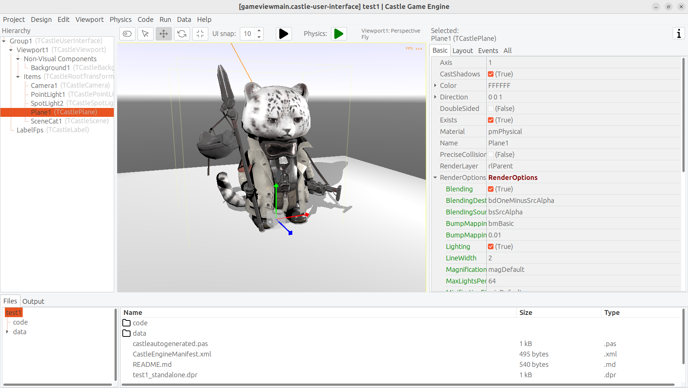

# The bad way to play chess: 3D physics fun using Castle Game Engine (Part 1)
Michalis Kamburelis
:toc: left
:toclevels: 4
:sectnums:
:source-highlighter: coderay
:docinfo1:

image::images_1/view_chess.png[Chessboard with chess pieces designed in the editor]

## Introduction

I remember my first book about chess, when I was a kid. It was a book teaching young people how to play chess. The first chapter started with a tale about children _playing chess incorrectly_: they didn't know the rules, so they put chess pieces randomly on the chessboard, and flicked them with their fingers towards the other side. The wooden chess pieces flew in the air, bashed with each other. Eventually most of the chess pieces fell off the chessboard onto the floor. The person with the last chess piece remaining on the chessboard was the winner.

That was naturally a bad way to play chess. In the second chapter of the book, an adult came, told children that they play chess wrong, and taught them the _right way_ -- how each figure moves, how the king is special, what it means to check and then mate your opponent. The book overall was great, and it's likely responsible for my love for chess (the _proper_ version of the game, with rules instead of flicking objects) to this day.

That being said... Don't you want to play some day this _"incorrect"_ version of chess, the children's version, where nothing else matters except just sending each chess piece flying toward the other side?

In this series of articles we will go back in time, erase our hard-earned knowledge about how to _really_ play chess, and implement a simple 3D physics fun application where you can flick chess pieces using physics. You can treat it as a game for 2 people -- just play it on a computer, and let each player use the mouse and keyboard in turn.

## The Real Introduction

The real purpose of this article is to be an entertaining but also useful introduction to using _Castle Game Engine_.

_Castle Game Engine_ is a cross-platform (desktop, mobile, consoles) 3D and 2D game engine. We will learn how to make a game for desktops (Linux, Windows, macOS, FreeBSD).

In the first part of the article we will show how to design a 3D chessboard and chess pieces using _Castle Game Engine_ editor and how to use _physics_. In the next part, we will do some coding in Pascal to implement the game logic. In future articles we'd like to show also development for other platforms (like Android and iOS) and future plans (like the _web platform_).

You can use FPC or Delphi to develop the application presented here. In our engine, we are committed to perfect support for both of these Pascal compilers. Though note that with Delphi, you can right now target only Windows (all the platforms are available with FPC).

_Castle Game Engine_ features a powerful visual editor to design your games, in 2D or 3D. Just like Delphi and Lazarus visual libraries, it's all based on a simple RAD concept: you can design a functional application easily visually but at the same time *everything you do is actually using Pascal classes and properties*. So all your knowledge gained from using the editor is also useful when you need to write some Pascal code. You will use the same classes and properties in Pascal that you've seen in the visual editor.

The engine is free and open-source. Use it to develop open-source or proprietary applications. You can distribute them to friends in any way, you can publish them on Steam, Itch.io, Google Play (Android), AppStore (iOS), your own website -- everywhere.

## Download and install the engine

Start by downloading the engine from our website: `https://castle-engine.io/download` . Choose the version suitable for your operating system.

* On Windows, the recommended download is a simple installer. Just run it.

* On Linux, just unpack the downloaded zip file to any directory you like.

* Follow our website for more detailed instructions and other platforms.

Once installed, run the _Castle Game Engine_ editor.

* If you used the installer on Windows, then the shortcut to run _Castle Game Engine_ has already been created for you.

* If you unpacked the engine a zip file, then run the binary `castle-editor` from the subdirectory `bin` where you have unpacked the engine.

If you encounter any issue, consult our manual on `https://castle-engine.io/install` .

## Create your first project

Let's create a new project. Click on the _"New Project"_ button, choose the _"Empty"_ project template, configure the project name and directory as you wish, and click _"Create Project"_.

In response, we will create a new directory with a few project files that define your project data and initial Pascal code.

You can explore the files in your project using the bottom panel of the editor. You can also just explore them using your regular file manager -- there's nothing special about this directory, these are normal files and directories.

The most important files and directories are:

- `code` is a subdirectory where we advise to put all Pascal source code (units) of your application. Initially it contains just 2 units, `GameInitialize` and `GameViewMain`.

- `data` is a subdirectory where you should put all the data that has to be loaded at run-time by your application. All the 3D and 2D models, textures, designs have to be placed here if you want to use them in your game. Initially it contains the _design_ called `gameviewmain.castle-user-interface` (and, less important, `CastleSettings.xml` and `README.txt` files).

The general idea is that the initial application (created from the _"Empty"_ template) contains just a single _view_ called `Main`. A _view_ is a _Castle Game Engine_ concept that represents something that can be displayed in a _Castle Game Engine_  application. You use it typically quite like a _form_ in Delphi or Lazarus. It is a basic way to organize your application.

- Every _view_ can be visually designed. Just double-click on it, in the _"Open Existing View"_ panel or in the _"Files"_ panel (when you're exploring the `data` subdirectory).
+
This allows to visually design the contents of the `gameviewmain.castle-user-interface` file. The file has an extension `.castle-user-interface` because a _view_ is a special case of _user interface_ in Castle Game Engine.
+
In larger applications, you can have multiple views. Also, in larger applications, you can visually design some _user interface_ elements that are not views, but are just reusable pieces of a user interface. All these files have the extension `.castle-user-interface` and can be visually designed using the editor. The views have, by convention, a name like `gameview*.castle-user-interface`.

- Every view has also an accompanying Pascal unit. The unit is named like the view, but without the `.castle-user-interface` extension. So in our case, the unit is called `gameviewmain.pas`. The unit contains the Pascal code that should be executed when the view is displayed. It defines a class that has virtual methods to react to various useful events (like view being started, or user pressing a key or a mouse button). You will often add more methods to it, to implement your application logic.

See `https://castle-engine.io/view_events` and `https://castle-engine.io/views` to learn more about the _views_ in our engine.

To be clear about the terminology used throughout our engine:

* A _design_ is a name for _a file you can visually design using our editor_. A design can be a file with extension:
** `.castle-user-interface` (user interface, can be loaded to a class descending from `TCastleUserInterface`)
** `.castle-transform` (3D or 2D transformation, can be loaded to a class descending from `TCastleTransform`)
** `.castle-component` (any other component; can be loaded to a class descending from `TComponent`)

* A _user interface design_ is a specific case of a _design_ file. It is a file with `.castle-user-interface` extension.

* A _view_ is a specific case of a _user interface design_. By convention it is called like `gameview*.castle-user-interface`.

You're probably itching to start actually _doing_ something after this lengthy introduction. Let's get to it.

As a first thing, make sure that everything works. Use the big _"Compile And Run"_ button (key shortcut _F9_) and watch as the project is compiled and run. The result will be boring -- dark window with FPS (_frames per second_) counter in the top-right corner. FPS are a standard way to measure your application performance.

image::images_1/first_run.png[First run of the project]

## Optionally tweak the editor preferences

Once things work, you may want to tweak them by going to editor _"Preferences"_. In particular:

- The editor by default uses a bundled version of latest stable _FPC (Free Pascal Compiler)_. If you'd rather use your own _FPC_ installation or _Delphi_, configure it in the preferences.

- To edit the Pascal files, the editor by default tries to auto-detect various Pascal-capable  IDEs and editors, like _Lazarus_, _Delphi_, _Visual Studio Code_. If you prefer to configure a specific editor, choose it in the preferences.

More details about the editor configuration can be found in our manual on `https://castle-engine.io/install` .

The editor can use any Pascal compiler and any text editor. We deliberately don't put any special requirements on what you can use. Though we make sure to support the popular choices perfectly. In particular, we have a dedicated support for using _Visual Studio Code_ with Pascal (and _Castle Game Engine_ in particular), see `https://castle-engine.io/vscode` .

## Learning to design 3D items in a viewport

If you haven't already, open the `main` view in the editor.

You can double-click on it in the _"Open Existing View"_ panel or in the _"Files"_ panel (when you're exploring the `data` subdirectory).

The initial view is mostly empty.

- It has a root component `Group1`, which is an instance of `TCastleUserInterface`. This component will contain everything else we design.

- And it has a label `LabelFps` (an instance of `TCastleLabel` class). At run-time, this label will display the FPS counter.

image::images_1/view_empty.png[Initial view]

Let's add more content to it. First of all, to display anything in 3D, you need a _viewport_. A viewport is a way to display 3D or 2D content. It is an instance of `TCastleViewport` class. Add it to the design by right-clicking on the `Group1` component and choosing _"Add User Interface -> Viewport (3D)"_ from the menu that appears.

image::images_1/add_viewport.png[Adding a viewport]

The result should look like this:

image::images_1/view_viewport.png[View with a viewport]

Following this, drag the new `Viewport1` component above the `LabelFps` in the _Hierachy_ panel (on the left). This way the FPS counter will be displayed in front of the viewport.

image::images_1/view_viewport_fps_front.png[FPS counter in front of the viewport]

Now play around in the 3D view. There are 3 objects in 3D world:

- Camera, called just `Camera1`, determines what the user will actually see once the game is run.

- Light source makes things _lit_ (bright). The initial light source is called `PointLight1` and it is an instance of `TCastlePointLight`, which is a simple light that shines in all directions from a given 3D position.

- Rectangle representing a ground called a `Plane1`. Mathematically speaking, it's not a _plane_, it's a rectangle -- however calling this a _"plane"_ is a convention used by a lot of 3D software.

Click and hold the _right mouse button_ over the viewport to look around. Use the AWSD keys to move. Use the _mouse scroll_ (while holding the right mouse button pressed) to increase or decrease the movement speed.

Play around with **moving the items**. Drag the 3D axis to move any object.

Play around with **adding new 3D items**. Right-click on `Items` component inside the `Viewport1` and from the context menu add primitives like _"Box"_, _"Sphere"_, _"Cylinder"_. Move them around, delete them (with _Delete_ key), duplicate (with _Ctrl+D_ key).

Change some properties. On the right side, you can see an _object inspector_, familiar to any Lazarus and Delphi user. Adjust the properties, for example change the `Size` of the `Plane1` to be much bigger. Click on _"..."_ (3 dots) button at the _"Color"_ property of any primitive (like a plane, a box, a sphere...) to change the color.

image::images_1/viewport_fun.png[Example result of adding some 3D items and changing their properties]

If you get stuck, consult our manual, in particular `https://castle-engine.io/viewport_and_scenes` and `https://castle-engine.io/viewport_3d` are helpful to learn basic 3D manipulation.

## Design a 3D chessboard with chess pieces

Above we learned to design a 3D world composed from simple primitives, like boxes and spheres.

But this isn't a way to create realistic 3D graphics. In most 3D graphic applications, the content is created using a specialized 3D _authoring tool_, like _Blender_. 3D artist creates a _mesh_ (a set of vertexes, connected to form edges and polygons), assigns materials and textures, and exports the resulting object to a file that can be read by a game engine -- like a glTF file.

glTF is a full-featured 3D model format developed by Khronos. _Castle Game Engine_ has great support for glTF, see `https://castle-engine.io/gltf` for details.

On _Castle Game Engine_ side, our most important component to display a 3D model is `TCastleScene`. It's a big component, playing central role in our engine (in one way or another, it is actually responsible for all of 3D and 2D rendering in our viewport). Using it is simple: you create an instance of `TCastleScene` and set its `URL`  property to point to the model you want to display (like a glTF file). The `TCastleScene` class descends from the `TCastleTransform` class, and as such you can move, rotate and scale the `TCastleScene` instances. Alternatively, you can also drag-and-drop the glTF file from the _"Files"_ panel to the viewport, editor will then automatically create a `TCastleScene` instance that loads the given model.

We support a number of 3D and 2D model formats, not only glTF. They are listed on `https://castle-engine.io/creating_data_model_formats.php` .

If you are capable of creating your own 3D models, for example in _Blender_, you can now make a detour: design a 3D model in Blender and export it to glTF using our instructions on `https://castle-engine.io/blender` .

Or you can use some ready-made stuff:

- There's a number of high-quality 3D content on the Internet, available also for free and on open-source-compatible licenses. We collect useful links on `https://castle-engine.io/assets.php` .

- Our engine also features an integration with _Sketchfab_, to allow you to search and download from a vast repository of free 3D models without leaving our editor. See the `https://castle-engine.io/sketchfab` documentation.
+
Here's a sample -- battle-hardened cat model, from Sketchfab, right inside our editor:
+

+

+
_Credits: The "Cat" 3D model was done by Muru (`https://sketchfab.com/muru`) and is available on Sketchfab (`https://sketchfab.com/3d-models/cat-16c3444c8d1440fc97fdf10f60ec58b0`) on CC-BY-4.0 license_.

- Finally, we have a ready set of 3D models for the chessboard and all chess pieces, that you can use for this demo.

To use the last option, download the 3D models from `https://github.com/castle-engine/bad-chess/releases/download/chess-models/chess-models.zip` . They were made based on open-source Blender model published on `https://blendswap.com/blend/29244` by _Phuong2647_.

Unpack the resulting archive anywhere _under the `data` subdirectory of your project_.

Then simply drag-and-drop the `*.gltf` files onto the viewport. Move and duplicate them as needed, to arrange them into a starting chess position.

NOTE: For our silly physics game, it actually completely doesn't matter how you will arrange them. You also don't need to position and rotate them perfectly. Have fun :)

This is an example result:

image::images_1/view_chess.png[Chessboard with chess pieces designed in the editor]

Once you've designed the chessboard and put chess pieces on it, also make sure to adjust the lights to make everything nicely bright (but not too bright).

Finally, adjust the camera so that user sees a nice view of the board when the application starts. When you select a camera component (like `Camera1`, if you haven't renamed the default camera), the editor shows a small window with _camera preview_. You can click _"Pin"_ in this window to keep observing the world from this camera. There are basically 2 ways to manipulate the camera:

1. Move and rotate the camera just like any other 3D object. Look at the _camera preview_ to judge whether the camera view looks good.

2. Or, alternatively, navigate in the editor and then use the menu item _"Viewport -> Align Camera To View"_ (key shortcut _Ctrl + Numpad 0_) to make the camera view match the current view in the editor.

image::images_1/camera.png[Camera adjustment]

Once you have a nice view, make sure it all works: compile and run the application again.

## Using physics in the editor

Now that the proper chessboard with chess pieces is designed, let's use physics to make things _crazier_.

_Castle Game Engine_ has a support for _rigid body physics_. This means that:

- Objects can be affected by _forces_.
+
The force that works automatically is _gravity_, pulling objects down (in the direction of the negative Y axis, by default).
+
You can also define additional forces from code, to e.g. push things along an arbitary direction. Your own forces can realize a range of real-life effects, like wind, explosions, spinning tornadoes, etc.

- Collisions between objects are automatically detected and resolved. That is, by default the objects will _bounce off_ each other.
+
It is also possible to detect collisions in code and react to them in any way (e.g. an enemy may explode when it collides with a rocket).

////
It is also possible for some objects to be _triggers_, in which case the objects do not _bounce off_ when they collide with them.
////

- You can also connect certain objects using _joints_.

We will not explore all these features in our article, but we will show you how to enjoy the basics. To learn more about the possibilities, read our manual `https://castle-engine.io/physics` and play with demoes in the `examples/physics/` subdirectory of the engine. Here's a screenshot from one of the demos, showing explicit application of physics forces:

_Castle Game Engine_ physics internally uses _Kraft_, a physics engine deveveloped in Pascal by _Benjamin 'BeRo' Rosseaux_.

Any component descending `TCastleTransform`, including primitives (like `TCastleBox`) or scenes loaded from models (`TCastleScene`) or a group of other objects (`TCastleTransform` with children) can be a _rigid body_ for the physics engine that participates in the collision detection and resulting movement. The object needs to have two _behaviors_:

1. `TCastleRigidBody` behavior makes the component a _rigid body_. It defines common physics properties, like whether the object is affected by gravity and the initial movement speed.

2. A _collider_, which stands for __any component descending from the abstract class ``TCastleCollider``__. Many collider shapes are possible, like `TCastleSphereCollider`, `TCastleBoxCollider` and `TCastleMeshCollider`.
+
Using the `TCastleMeshCollider` results in most precise collisions, but the colliding object must be _static_ which means that other objects will _bounce off_ this object, but the object with `TCastleMeshCollider` will not move itself.

The term _behavior_ we used above is a special mechanism in _Castle Game Engine_ to attach additional functionality to a `TCastleTransform`. Behaviors are a great way to define various functionality that enhances given game object. There are various built-in behaviors and you can also define your own. See `https://castle-engine.io/behaviors` for more information.

After this overview, you're ready to actually use physics in our chess game.

Right-click on the component representing the chessboard. From the context menu choose _"Add Behavior (Extends Parent Transform) -> Physics -> Collider -> Mesh"_. In response, you will notice that 2 components have appeared in the component tree: `MeshCollider1` and `RigidBody1`. That's a convenience feature of the editor: adding a collider also adds a rigid body component.

Next choose any chess piece. Right-click on it and from the context menu choose _"Add Behavior (Extends Parent Transform) -> Physics -> Collider -> Box"_. Note that we use a simpler collider for the chess piece, which is also dynamic. This will allow the chess piece to actually fall down on the board.

Finally move the chess piece to a more dramatic position, above the board, so that it will fall down when the physics will start.

We are ready to run physics. One way would be to just run the application, using the _"Compile And Run"_ as you've done before. But there's a quicker way to experiment with physics: run _physics simulation_ by using the green play icon at the header of the editor (or menu item _"Physics -> Play Simulation"_, key shortcut _Ctrl+P_).

Do this and watch in awe as the pawn falls on the board.

Remember to finish the physics simulation when you're done (press the green stop button, or again menu item _"Physics -> Play Simulation"_, key shortcut _Ctrl+P_). Editing the design during the physics simulation is allowed (and it's a great way to experiment with various physics settings) but _the changes are not saved when physics simulation is running_. That's because physics typically moves the objects, and you don't want to save this position resulting from physics interactions. So be sure to _stop the physics simulation before doing any persistent changes to the design_.

To get more spectacular results:

- Add physics colliders to more chess pieces.

- Move the chess pieces to more interesting positions, so that multiple pieces will fall down from above on multiple other chess pieces.

- You can also duplicate (key shortcut _Ctrl+D_) the chess pieces (it will duplicate the whole selected object, including physics behaviors if any). That
s an easy way to have a lot of physical objects that bounce off each other.

After each change, just play and stop physics simulation again.

Make sure that the initial position of all rigid bodies does not make some pair collide with each other right at the start. If the two objects will collide at start, physics engine may (sometimes quite explosively) move them away from each other.

This is a sample result:

image::images_1/physics_chess_more_dramatic.png[Chess pieces after a more dramatic physics simulation]

One last thing remains to learn in this (first) part of the article: how to _flick_ the chess piece?

1. From Pascal code you can use various methods to apply a force on a rigid body. More about this in the next article part. You can also experiment with the example application `examples/physics/physics_forces/` if you're impatient.

2. Or you can set a specific `LinearVelocity` on a rigid body component.

We will use the latter approach, as it can be trivially done and tested in the editor.

* Select the chess piece. Any chess piece you want to _"flick"_ (throw across the board).

* Make sure it has a collider and rigid body components (if not, add them, as above).

* Select the `TCastleRigidBody` component of it, and find the `LinearVelocity` property in it.

* Set `LinearVelocity` to any large non-zero vector, like `-100 0 0`. This means we have a velocity of 100 units per second in the negative X direction.

Run the physics simulation and watch the mayhem.

image::images_1/physics_flick.png[Flicked chess piece]

## Summary

We have designed a 3D application using _Castle Game Engine_ with a bit of physics. We didn't yet write any Pascal code to do any interactions -- this will be done in the next part of the article.

If you want to download a ready application, resulting from this, go to `https://github.com/castle-engine/bad-chess` . The subdirectory `project` of that repository contains the final working demo of this. It will be extended in the next part of the article.

I hope you had fun doing this demo and exploring the possibilities of _Castle Game Engine_.

If you have any questions or feedback about the engine, don't be shy! Speak up, ask and share your comments on our forum `https://forum.castle-engine.io` or Discord `https://castle-engine.io/talk.php` .