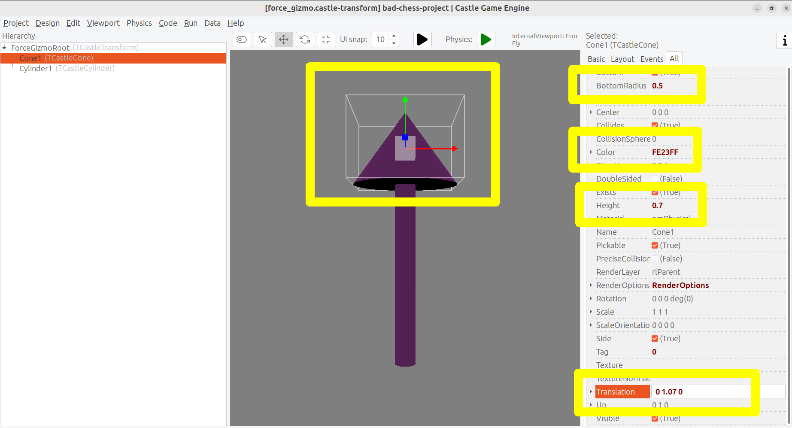
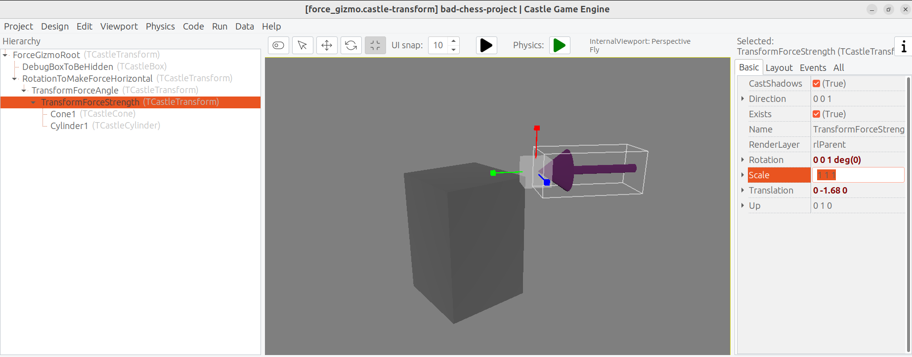
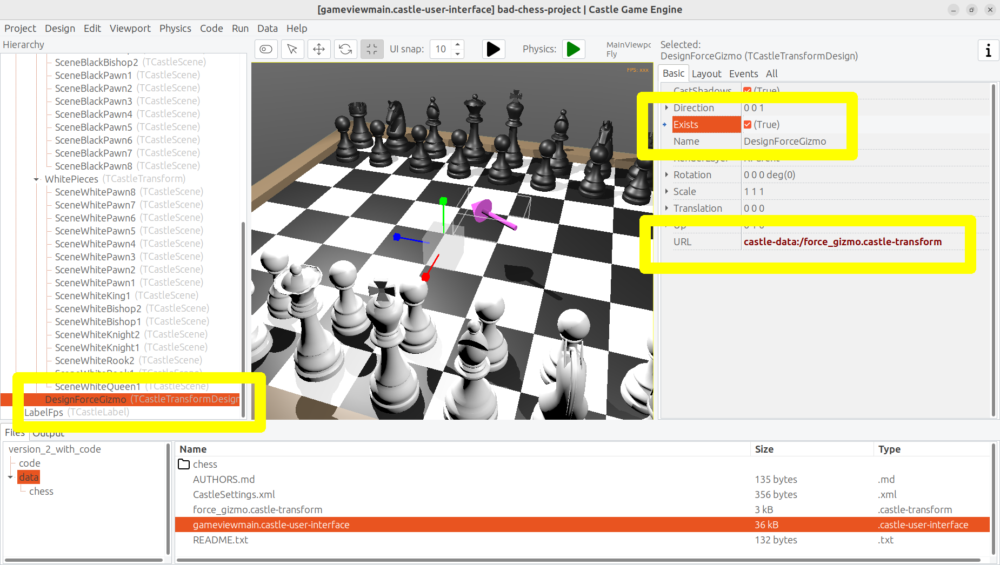

# The bad way to play chess: 3D physics fun using Castle Game Engine (Part 2)
Michalis Kamburelis
:toc: left
:toclevels: 4
:sectnums:
:source-highlighter: coderay
:docinfo1:

## Introduction

Welcome to the second part of the article about creating a simple 3D physics game using _Castle Game Engine_.

_Castle Game Engine_ is a cross-platform (desktop, mobile, consoles) 3D and 2D game engine using modern Pascal. It's free and open-source and works with both FPC and Delphi.

In the first part, we learned how to use the visual editor and we have designed a chessboard with chess pieces. Then we used physics to throw the chess piece, such that it collides and knocks down other chess pieces. Remember this is a _bad_ way to play chess. But it's really fun!

If you have missed the first part, you can still "jump in" at this point. Just download _Castle Game Engine_ from https://castle-engine.io/ and either set up the chessboard and chess pieces yourself, or use our ready example project from https://github.com/castle-engine/bad-chess/ in the subdirectory `project/version_1_designed_in_editor`. This project version is a good starting point for this article part.

We encourage you to follow this article and perform all the steps yourself, to create a similar toy. If you ever get stuck, you can look at the finished project. It is available in the subdirectory `project/version_2_with_code` in the same repository, https://github.com/castle-engine/bad-chess/ . It's the final project, with everything described in this article done and working.

And if you really just want to play the worst version of chess, _right now_, you can download the ready compiled game (for Linux or Windows) from https://castle-engine.itch.io/bad-chess . Enjoy!

## Coding the game

The focus of this part is to learn how to use Pascal code to make things happen in your game.

The core of _Castle Game Engine_ is just a set of Pascal units that can be compiled using FPC and Delphi. Thus the games we create are also just regular Pascal programs that happen to use a few _Castle Game Engine_ units. This means that you can use the workflow you already know and like, with whatever Pascal text editor and compiler you prefer.

In particular we support _Delphi_, _Lazarus_, _VS Code_ or any other custom editor (like _Emacs_). We have a dedicated documentation with some IDE-specific hints on https://castle-engine.io/manual_ide.php . Basically just open in _Castle Game Engine_ editor the panel _"Preferences -> Code Editor"_, configure there which Pascal IDE you use, and everything should work out-of-the-box.  If you double-click on a Pascal file from CGE editor, it will open in the text editor you configured.

Specifically for _VS Code_ users, the page https://castle-engine.io/vscode contains information how to setup _VS Code_ with _Castle Game Engine LSP server_ to get great code completion. We are working right now on a dedicated _Castle Game Engine_ extension for _VS Code_ that will make this integration even easier.

image::images_2/editor_and_vscode.png[CGE editor and VS Code]

Note that, while the focus of this chapter is to write Pascal code, we do not stop using _Castle Game Engine_ editor. There are a few things you can do in the editor to make the design "friendly" to the code manipulation and we will explore them in this article. So writing Pascal code, and editing the design visually, go hand-in-hand.

## Exercises

### Handle a key press to change position of an object

Let's start simple. First goal: When user presses a key `x`, we want to move the _black king_ chess piece a bit higher. It's a simple test that we can:

- React to user input (key press).

- In response, do something interesting in 3D world (move a chess piece).

Most of the code you write in _Castle Game Engine_ is placed in a unit associated with a _view_. We talked about what is a _view_ in _Castle Game Engine_ in the previous article part, the short recap is that you use views similar to how you use _forms_ in a typical Delphi FMX / VCL or Lazarus LCL application: a view is a _visual design_ (in `data/gameviewmain.castle-user-interface`) and associated code (in `code/gameviewmain.pas`).

So let's open the file `code/gameviewmain.pas` in your favorite Pascal IDE. In the _Castle Game Engine_ editor, you can just use the bottom _"Files"_ panel. Enter the `code` subdirectory and double-click on the `gameviewmain.pas` file. Alternatively, you can just open your Pascal IDE and from it open the Pascal project. The basic project files (like `my_project.dproj` for Delphi or `my_project.lpi` for Lazarus) have been already generated for you.

Keep the _Castle Game Engine_ visual editor open too, with our view design `data/gameviewmain.castle-user-interface` . We will occasionally adjust or consult our visual design, to make sure it is useful for our code logic.

For start, we want to know the _name_ of the component representing the black king. Just as you've seen when designing Lazarus and Delphi forms, every component has a _name_ which corresponds to how this component can be accessed from code. You can edit the component name in _Castle Game Engine_ by either editing the `Name` row in _Object Inspector_ (on the right) or editing the name in the hierarchy (on the left). Simply click on the component name in hierarchy or press F2 to go into name editing. On the screenshot below, you can see that black king is named `SceneBlackKing1`. I can use Ctrl+C to copy this to the clipboard.


Note that, for this first code exercise, we assume that the chess piece (`SceneBlackKing1`) does *not* have any physics components. If you have added `TCastleRigidBody` or `TCastleXxxCollider` components as behaviors of `SceneBlackKing1`, please remove them for now. We will restore them in the next exercise.

Now we have to declare the variable with the exact same name in the view. It will be automatically initialized to point to the component when we start the view. Do this in the `published` section of the class `TViewMain`. This is how the end result should look like:

```delphi
uses Classes,
  CastleVectors, CastleComponentSerialize,
  CastleUIControls, CastleControls, CastleKeysMouse, CastleScene;

type
  { Main view, where most of the application logic takes place. }
  TViewMain = class(TCastleView)
  published
    { Components designed using CGE editor.
      These fields will be automatically initialized at Start. }
    LabelFps: TCastleLabel;
    SceneBlackKing1: TCastleScene; //< new line
  public
  ...
```

Note: Right now, the _Castle Game Engine_ editor doesn't do this automatically for you. That is, we don't automatically update your Pascal sources to declare all the components. We have a plan to do this soon. The user experience will have to be a bit different than on Delphi and Lazarus forms, because the game visual designs can easily have hundredths of components that are _not supposed to be used from code_, so synchronizing them _all_ with Pascal code would create unnecessary noise in your Pascal unit. We will instead make a button to only expose a subset of designed components for code.

Once you have declared the _published field_, we can access the `SceneBlackKing1` from code, getting and setting its properties, calling its methods anywhere we like. For this exercise, let's modify the `Translation` property of our chess piece, which changes the _position_ of the object.

It is a property of type `TVector3`. `TVector3` is an advanced record in _Castle Game Engine_ that represents 3D vector -- in this case a position, but we use it in many other cases too, e.g. to represent a direction or even RGB color. There are a number of useful things defined to help you work with `TVector3`, in particular:

- `Vector3(...)` function returns a new `TVector3` value with given coordinates.

- The arithmetic operators like `+` work with `TVector3` values.

This means that we can easily move object by writing a code like this:

```delphi
SceneBlackKing1.Translation := SceneBlackKing1.Translation + Vector3(0, 1, 0);
```

Where to put this statement? In general, you can use this code anywhere in your view (as long as it executes only after the view has been started). In this case, we want to react to user pressing a key `x`. To achieve this, we can edit the `TViewMain.Press` method in the view. The empty implementation of this method is already present, with some helpful comments, so we can just fill it with our code:

```delphi
function TViewMain.Press(const Event: TInputPressRelease): Boolean;
begin
  Result := inherited;
  if Result then Exit; // allow the ancestor to handle keys

  if Event.IsKey(keyX) then
  begin
    SceneBlackKing1.Translation := SceneBlackKing1.Translation + Vector3(0, 1, 0);
    Exit(true); // key was handled
  end;
end;
```

Build and run the game (e.g. by pressing F9 in _Castle Game Engine_ editor, or in Delphi, or in Lazarus) and press `X` to see how it works.

### Push the chess piece using physics

Let's do one more exercise. Let's make sure we can use code to push (flick, throw) a chess piece using physics. The chess piece we push, and the direction in which we push it, will be hardcoded in this exercise. But we will get confidence that we can use physics from Pascal code.

Let's use the black king again.

To do this, let us *add* the physics components to the relevant chess piece. We described how to do this in last article part, the quick recap is to right-click on the component (`SceneBlackKing1` in this case) and from the context menu choose _"Add Behavior -> Physics -> Collider -> Box (TCastleBoxCollider)"_. Make you also have physics (with `TCastleMeshCollider`) active on the chess board, otherwise the chess piece would fall down due to gravity as soon as you run the game.

This is how it should look like:

image::images_2/chess_piece_physics.png[Chess piece with physics components]

To push it using physics, we want to use the `ApplyImpulse` method of the `TCastleRigidBody` component associated with the chess piece.

- You can get the `TCastleRigidBody` component using the `SceneBlackKing1.FindBehavior(TCastleRigidBody)` method, as shown below.
+
Alternatively, you could also declare and access `RigidBody1: TCastleRigidBody` reference in the published section of your view. We don't show this approach here, just because using the `FindBehavior` seems more educational at this point, i.e. you will find the `FindBehavior` useful in more situations.

- The `ApplyImpulse` method takes two parameters: the strength and direction of the impulse (as `TVector3`, length of this vector determines the strength) and the position from which the impulse comes (it is simplest to just use the chess piece position here).

In the end, this is the modified version of `TViewMain.Press` that you should use:

```delphi
function TViewMain.Press(const Event: TInputPressRelease): Boolean;
var
  MyBody: TCastleRigidBody;
begin
  Result := inherited;
  if Result then Exit; // allow the ancestor to handle keys

  if Event.IsKey(keyX) then
  begin
    MyBody := SceneBlackKing1.FindBehavior(TCastleRigidBody) as TCastleRigidBody;
    MyBody.ApplyImpulse(Vector3(0, 10, 0), SceneBlackKing1.WorldTranslation);
    Exit(true); // key was handled
  end;
end;
```

Above we use the direction `Vector3(0, 10, 0)` which means "up, with strength 10". You can experiment with different directions and strengths. If we'd like to push the chess piece at other pieces (which we will, in the next exercise), we would use directions more along the X and Z axes, and leave Y axis zero.

To the uses clause, add also `CastleTransform` unit, to have `TCastleRigidBody` defined.

As usual, run the game and test. Pressing X should now bump the chess piece up.

You can press X repeatedly, even when the chess piece is already in the air, as you see in our code -- we don't secure from it. We will not cover it in this exercise, but you could use `MyBody.PhysicsRayCast` to cast a ray with direction `Vector3(0, -1, 0)` and see whether the chess piece is already in the air.


## Make code aware "what is a chess piece" using behaviors

To implement our desired logic, the code has to somehow know _"what is a chess piece"_. So far, our 3D world is a collection of `TCastleScene` components, but it does not give us enough information to distinguish between chess pieces and other objects (like a chessboard). We want to do something crazy, but we don't want to flip the chessboard! At least not this time :)

To "mark" that the given `TCastleScene` component is a chess pieces we will invent a new class called `TChessPieceBehavior` descending from the `TCastleBehavior` class. We will then attach instances of this class to the `TCastleScene` components that represent chess pieces. In the future this class can have more fields (holding information specific to this chess piece) and methods. For start, the mere _existence_ of `TCastleBehavior` instance attached to a scene indicates _"this is a chess piece"_.

To know more about how our _behaviors_ work, see https://castle-engine.io/behaviors for documentation and examples. You can also create a new project from the _"3D FPS Game"_ template and see how the `TEnemy` class is defined and used. The _behaviors_ is a very flexible concept to add information and mechanics to your world and we advise to use it in many situations.

There's really nothing difficult about our initial `TChessPieceBehavior` definition. It is almost an empty class, however at the last minute I decided to add there a `Boolean` field that says whether the chess piece is a white or black piece:

```delphi
type
  TChessPieceBehavior = class(TCastleBehavior)
  public
    Black: Boolean;
  end;
```

You can add it at the beginning of the `implementation` section of unit `GameViewMain`. But for larger projects, I would advise to create a separate unit to define and implement this class.

How to actually attach the behavior instances to the scenes?

1. You could do this visually, by registering the `TChessPieceBehavior` class in the _Castle Game Engine_ editor.
+
This is a very powerful method as it allows to visually add and configure the behavior properties. See the https://castle-engine.io/custom_components for description how to use this.

2. Or you can do it from code. In this article, I decided to go with this approach.
+
This is a bit easier if you have to effectively attach the behavior 32 times, to all the chess pieces, and there's no need to specifically configure the initial state of the behavior. Clicking 32 times _"Add Behavior"_ would be a bit tiresome and also unnecessary in our simple case (for this demo, all chess pieces really work the same), so let's instead utilize code to easily initialize the chess pieces.

To attach a behavior to our `SceneBlackKing1`, we can just create the instance of `TChessPieceBehavior` in our views's `Start` method, and add using `SceneBlackKing1.AddBehavior`. Like this:

```delphi
procedure TViewMain.Start;
var
  ChessPiece: TChessPieceBehavior;
begin
  inherited;
  ChessPiece := TChessPieceBehavior.Create(FreeAtStop);
  ChessPiece.Black := true;
  SceneBlackKing1.AddBehavior(ChessPiece);
end;
```

But this is only the beginning. Above we added `TChessPieceBehavior` to only one chess piece. We want to add it to all 32 the chess pieces. How to do it easily? We need to somehow iterate over all the chess pieces. To set the `Black` boolean field, we also should somehow know whether this is black or white. There are multiple solutions:

1. We could assume that all chess pieces have names like `SceneWhiteXxx` or `SceneBlackXxx`. Then we can iterate over `Viewport1.Items` children, and check if their `Name` starts with given prefix.

2. Or we could look at `Tag` value of scenes, and have a convention e.g. that `Tag = 1` means black chess piece, `Tag = 2` means white chess piece, and other tags (`Tag = 0` is default, in particular) mean that this is not a chess piece.

3. Wd could also introduce additional transformation components that group black chess pieces separately from white chess pieces and separately from other stuff (like a chessboard).

I decided to go with the latter approach, as introduction of _"additional nodes to group existing ones"_ is a powerful mechanism in many other situations. E.g. you can then easily hide or show a given group (using `TCastleTransform.Exists`) property.

To make this happen, right-click on `Viewport1.Items`, and choose from the context menu _"Add Transform -> Transform (TCastleTransform)"_.

image::images_2/adding_transform.png[Adding new transform]

Name this new component `BlackPieces`. Then drag-and-drop in the editor hierarchy all the black chess pieces (`SceneBlackXxx` components) to be children of `BlackPieces`. You can easily select all 16 scenes representing black pieces in the hierarchy by holding the _Shift_ key and then drag-and-drop them all at once into `BlackPieces`.

The end result should look like this in the hierarchy:

image::images_2/black_pieces_group.png[Black pieces group]

Don't worry that only the `SceneBlackKing1` has the physics components. We will set the physics components using code soon too.

Now repeat the process to add a `WhitePieces` group.

image::images_2/white_pieces_group.png[White pieces group]

This preparation in the editor makes our code task easier. Add to the published section of `TViewMain` declaration of `BlackPieces` and `WhitePieces` fields, of type `TCastleTransform`:

```delphi
  TViewMain = class(TCastleView)
  published
    ... // keep other fields too
    BlackPieces, WhitePieces: TCastleTransform;
```

Now iterate over the 2 chess pieces group in the `Start` method:

```delphi
procedure TViewMain.Start;

  procedure ConfigureChessPiece(const Child: TCastleTransform; const Black: Boolean);
  var
    ChessPiece: TChessPieceBehavior;
  begin
    ChessPiece := TChessPieceBehavior.Create(FreeAtStop);
    ChessPiece.Black := true;
    Child.AddBehavior(ChessPiece);
  end;

var
  Child: TCastleTransform;
begin
  inherited;
  for Child in BlackPieces do
    ConfigureChessPiece(Child, true);
  for Child in WhitePieces do
    ConfigureChessPiece(Child, false);
end;
```

It seems prudent to add basic "sanity check" at this point. Let's log the number of chess pieces each side has. Add the following code and the end of the `Start` method:

```delphi
WritelnLog('Configured %d black and %d white chess pieces', [
  BlackPieces.Count,
  WhitePieces.Count
]);
```

To make `WritelnLog` available, add `CastleLog` unit to the uses clause. Now when you run the game, you should see a log

```
Configured 16 black and 16 white chess pieces
```

On my first run, I actually saw that I have 17 chess pieces on each side by accident. I mistakenly added 3 knights instead of 2 (one knight was at exactly the same position as another, so it wasn't obvious). I have removed the excessive knight pieces thanks to this log. Detecting such mistakes is exactly the reason why we add logs and test -- so I encourage you to do it too.

While we're at it, we can also use this opportunity to make sure all chess pieces have  physics components (`TCastleRigidBody` and `TCastleBoxCollider`). So you don't need to manually add them all. This is a reasonable approach if the components don't need any manual adjustment per-chess-piece.

To do this, extend our `ConfigureChessPiece` method:

```delphi
  procedure ConfigureChessPiece(const Child: TCastleTransform; const Black: Boolean);
  begin
    ... // keep previous code too
    if Child.FindBehavior(TCastleRigidBody) = nil then
      Child.AddBehavior(TCastleRigidBody.Create(FreeAtStop));
    if Child.FindBehavior(TCastleCollider) = nil then
      Child.AddBehavior(TCastleBoxCollider.Create(FreeAtStop));
  end;
```

As you see above, this approach is quite direct: if you don't have the necessary component, just add it. I don't bother to configure any property on the new `TCastleRigidBody` and `TCastleBoxCollider` instances, as their defaults are good for our purpose.

This was all a good "ground work" for the remaining article part. Nothing functionally new has actually happened in our game, you should run it and see that... nothing changed. All 32 chess pieces just stand still, at the beginning.

## Selecting 3D object using the mouse

### Highlight the chess piece under mouse and allow selecting it

To implement the real interaction, we want to allow user to choose which chess piece to flick using the mouse. _Castle Game Engine_ provides a ready function that tells you what is being indicated by the the current mouse (or last touch, on mobile) position. This is the `TCastleViewport.TransformUnderMouse` function.

For start, make sure to declare the viewport instance in the `published` section of class `TViewMain`, like this:

```delphi
MainViewport: TCastleViewport;
```

Match the name of your viewport in the design. Add unit `CastleViewport` to the `uses` clause to make type `TCastleViewport` known.

Let's utilize it to highlight the currently selected chess piece. We can just keep checking the `MainViewport.TransformUnderMouse` value in each `Update` call.

Note: Alternatively, we could check the result in each `Motion` call, that occurs only when mouse (or touch) position changes. But doing it in `Update` is a bit better: as we use physics, some chess pieces may still be moving due to physics, so the chess piece under the mouse may change even if the mouse position doesn't change.

To actually show the highlight, we will use a ready effect available for every `TCastleScene` that can be activated by setting `MyScene.RenderOptions.WireframeEffect` to something else than `weNormal`. This is probably the simplest way to show the highlight.

Before we jump into code, I encourage to experiment with perfect settings of `RenderOptions` for highlight in the editor. Just edit any chosen chess piece, until it seems to have a pretty highlight, and remember the chosen options. The useful properties to adjust are `WireframeEffect`, `WireframeColor`, `LineWidth`, `SilhouetteBias`, `SilhouetteScale`. You can see them emphasized below -- editor shows properties which have non-default values using bold.


I decided to show the currently highlighted chess piece with a light-blue wireframe. The currently highlighted chess piece is set as the value of private field `ChessPieceHover`.

Moreover, once user clicks with mouse (we can detect it in `Press`) the chess piece is considered selected and gets a yellow highlight. This chess piece is set as `ChessPieceSelected`.

Remembering the `ChessPieceHover` and `ChessPieceSelected` values is useful for a few things. This allows to later disable the effect (when the piece is no longer highlighted or selected). And it will allow to flick the `ChessPieceSelected` in the next chapters.

We could store them as references to `TCastleScene` or `TChessPieceBehavior`. It doesn't really matter, because we can always get one from the other.

- To get `TChessPieceBehavior` from corresponding `TCastleScene` you can do:
+
```delphi
var
  MyBehavior: TChessPieceBehavior;
  MyScene: TCastleScene;
begin
  ...
  MyBehavior := MyScene.FindBehavior(TChessPieceBehavior) as TChessPieceBehavior;
```

- To get `TCastleScene` from corresponding `TChessPieceBehavior` you can do:
+
```delphi
var
  MyBehavior: TChessPieceBehavior;
  MyScene: TCastleScene;
begin
  ...
  MyScene := MyBehavior.Parent as TCastleScene;
```

I decided to use `TChessPieceBehavior`. If you want to follow my approach exactly, add this to the `private` section of class `TViewMain`:

```delphi
ChessPieceHover, ChessPieceSelected: TChessPieceBehavior;
{ Turn on / off the highlight effect, depending on whether
  Behavior equals ChessPieceHover, ChessPieceSelected or none of them.
  It accepts (and ignores) Behavior = nil value. }
procedure ConfigureEffect(const Behavior: TChessPieceBehavior);
```

Then add `CastleColors` unit to the `uses` clause (of `interface` or `implementation` of unit `GameViewMain`, doesn't matter in this case) to define `HexToColorRGB` utility.

Finally this is the code of new `Update`, `Press` and helper `ConfigureEffect` methods:

```delphi
procedure TViewMain.ConfigureEffect(const Behavior: TChessPieceBehavior);
var
  Scene: TCastleScene;
begin
  if Behavior = nil then
    Exit;
  { Behavior can be attached to any TCastleTransform.
    In our case, we know it is attached to TCastleScene. }
  Scene := Behavior.Parent as TCastleScene;
  if (Behavior = ChessPieceHover) or
     (Behavior = ChessPieceSelected) then
  begin
    Scene.RenderOptions.WireframeEffect := weSilhouette;
    if Behavior = ChessPieceSelected then
      Scene.RenderOptions.WireframeColor := HexToColorRGB('FFEB00')
    else
      Scene.RenderOptions.WireframeColor := HexToColorRGB('5455FF');
    Scene.RenderOptions.LineWidth := 10;
    Scene.RenderOptions.SilhouetteBias := 20;
    Scene.RenderOptions.SilhouetteScale := 20;
  end else
  begin
    Scene.RenderOptions.WireframeEffect := weNormal;
  end;
end;

procedure TViewMain.Update(const SecondsPassed: Single; var HandleInput: Boolean);
var
  OldHover: TChessPieceBehavior;
begin
  inherited;

  LabelFps.Caption := 'FPS: ' + Container.Fps.ToString;

  OldHover := ChessPieceHover;

  if MainViewport.TransformUnderMouse <> nil then
  begin
    ChessPieceHover := MainViewport.TransformUnderMouse.FindBehavior(TChessPieceBehavior)
      as TChessPieceBehavior;
  end else
    ChessPieceHover := nil;

  if OldHover <> ChessPieceHover then
  begin
    ConfigureEffect(OldHover);
    ConfigureEffect(ChessPieceHover);
  end;
end;

function TViewMain.Press(const Event: TInputPressRelease): Boolean;
var
  MyBody: TCastleRigidBody;
  OldSelected: TChessPieceBehavior;
begin
  Result := inherited;
  if Result then Exit; // allow the ancestor to handle keys

  // ... if you want, keep here the handling of keyX from previous exercise

  if Event.IsMouseButton(buttonLeft) then
  begin
    OldSelected := ChessPieceSelected;
    if (ChessPieceHover <> nil) and
       (ChessPieceHover <> ChessPieceSelected) then
    begin
      ChessPieceSelected := ChessPieceHover;
      ConfigureEffect(OldSelected);
      ConfigureEffect(ChessPieceSelected);
    end;
    Exit(true); // mouse click was handled
  end;
end;
```

You will notice that `MainViewport.TransformUnderMouse` detects what is under the mouse, treating each chess piece as a box. Set `PreciseCollisions` to `true` on all the chess pieces to make the detection more accurate. You can do this easily by selecting all chess pieces in editor using _Shift_ and _Ctrl_ and then setting `PreciseCollisions` in _Object Inspector_.


As always, remember to compile and run the code to make sure it works OK!

I decided to move the camera at this point (to show both sides, black and white, from a side view).

image::images_2/better_camera.png[Camera from the side]


### Sidenote: Other ways to show a highlight

There are other ways to show the highlighted (or selected) chess piece.

- Dynamically changing the material color. Do this by accessing an instance of `TPhysicalMaterialNode` within the scene's nodes (`TCastleScene.RootNode`) and changing the `TPhysicalMaterialNode.BaseColor`. See e.g. engine example `examples/viewport_and_scenes/collisions/` that uses this.

- Dynamically adding/removing a shader effect. This means adding `TEffectNode` and `TEffectPartNode` nodes to the scene and implementing the effect using GLSL (_OpenGL Shading Language_). See e.g. engine example `examples/viewport_and_scenes/shader_effects/` that demonstrates this.

- Adding a additional box that surrounds chosen object. The CGE editor itself uses this technique to show highlighted / selected 3D objects. Use `TDebugTransformBox` class to implement this easy.

If you are curious, hopefully the above information and examples will point you in the right direction. We plan to also add a more straightforward API to manipulate scene materials from CGE in the upcoming engine 7.0 version.

### Sidenote: Shadows

I decided to activate shadows at this point. Just set `Shadows` to `true` on the main light source. Moreover, set `RenderOptions.WholeSceneManifold` at the chess pieces. This should make everything cast nice shadows. The shadows have _hard edges_ and are _dynamic_ which means that they will properly change when we will move the chess pieces.

See https://castle-engine.io/shadow_volumes for more information about shadows in _Castle Game Engine_.

image::images_2/shadows.png[Shadows]

## Let user choose the angle and strength to flick the chess piece

Once the user has picked a chess piece, we want to allow configuring the direction and strength with which to _flick_ the chosen object. We already know that _"flicking"_ the chess piece technically means _"applying a physics force to the rigid body of a chosen chess piece"_. We have almost everything we need, but we need to allow user to choose the direction and strength of this force.

### Designing a 3D arrow

To visualize the desired _force_ we will use a simple 3D arrow model, that will be rotated and scaled accordingly. While we could design such model in Blender or other 3D authoring software, in this case it's easiest to just do it completely in the _Castle Game Engine_ editor. The arrow is a composition of two simple shapes: _cone_ (for the arrow tip) and a _cylinder_.

Moreover let's design the arrow independently, as a separate _design_. The new _design_ will contain a hierarchy of components, with the root being `TCastleTransform`. We will save it as a file `force_gizmo.castle-transform` in the project `data` subdirectory. Then we will add it to the main design (`gameviewmain.castle-user-interface`), and toggle the existence, rotation and scale of the visualized force.

Using a separate design file for the 3D arrow, while not strictly necessary in this case, is a powerful technique. When something is saved as a separate design file, you can reuse it freely, and instantiate it many times (at design-time, or by dynamically _spawning_ during the game run-time). This is e.g. how to have creatures in your game: 3D objects that share common logic and that can be spawned whenever needed.

To start designing the arrow, choose editor menu item _"Design -> New Transform (Empty Transform as Root)"_.

image::images_2/new_transform.png[Shadows]

Underneath, add two components: `TCastleCylinder` and `TCastleCone`.

Adjust their `Height`, `Radius` (on cylinder), `BottomRadius` (on cone) and `Translation` to form a nice 3D arrow.

Adjust their `Color` to something non-default to make things prettier. Remember that the arrow with later be lit by the lights we have set up in the main design (`gameviewmain.castle-user-interface`), so it will probably be brighter than what you observe now.

You can follow the values I chosen on the screenshots below, but really these are just examples. Go ahead and create your own 3D arrow as you please :)



image::images_2/cylinder.png[Cylinder]

Now comes a bit difficult part. We want to have an arrow that can easily _rotate around a dummy box_ (in the actual game, it will rotate around a chess piece). Ideally, an arrow should also easily scale to visualize the force strength. I use the words _easily_ to emphasize that we don't want to only rotate it in the editor, but we will also have to allow user to rotate it during the game. So the rotation and scale that are interesting to us must be very easy to get and set from code.

To do this, first add a dummy box representing a chess piece. I called it `DebugBoxToBeHidden` and set `Size` of the box to `2 3 2` to account for tall (large Y axis) chess pieces. Later we will make the box hidden by setting its `Exists` property to `false`.

Once you have a box, you want to add intermediate `TCastleTransform` components to

1. rotate the arrow to be horizontal

2. move away arrow from the box

3. rotate the arrow around the box

4. scale the arrow

There are multiple ways of doing it. You can peek at the screenshots below, and at the design in our resulting project in https://github.com/castle-engine/bad-chess/ (in `project/version_2_with_code` subdirectory). The key advise is to not hesitate to make a nested composition, i.e. place `TCastleTransform` within another `TCastleTransform` within another `TCastleTransform` and so on. Let each `TCastleTransform` perform a single function.

image::images_2/arrow_1.png[Arrow RotationToMakeForceHorizontal component]

image::images_2/arrow_2.png[Arrow TransformForceAngle component]



The outcome of my design is that I know that from code, I can:

- Adjust `Rotation` property of the `TransformForceAngle` component to be a simple rotation around the X axis. The angle of this rotation can be chosen by user and effectively the arrow will _orbit_ around the debug box (chess piece).

- Adjust Y of the `Scale` property of the `TransformForceStrength` component. The amount of this scale can be chosen by user to visualize the strength.

Remember to set `Exists` of the `DebugBoxToBeHidden` component to `false` once done.

### Add the arrow to the main design

To test that it works, add the arrow design to the main design using the editor.

Save the design `force_gizmo.castle-transform`, open our main design in `gameviewmain.castle-user-interface`, select the `Items` component inside `MainViewport` and drag-and-drop the file `force_gizmo.castle-transform` (from the _"Files"_ panel below) on the hierarchy.

The result should be that a new component called `DesignForceGizmo1` is created and placed as a child of `Items`. The component class is `TCastleTransformDesign`, which means that it's an instance of `TCastleTransform` loaded from another file with `.castle-transform` extension. The `URL` property of this component should automatically be set to indicate our `force_gizmo.castle-transform` file.

Rename this component to just `DesignForceGizmo` (up to you, but I think it makes things clearer -- we will only ever need one such gizmo). Moreover, change the `Exists` property of this component to `false` because initially, we don't want this component to be visible or pickable by the mouse.

The screenshot below shows the state _right before I set `Exists` to `false`_.



### Letting user control the arrow

We need to declare and initialize the fields that describe current angle and strength.

Add this to the `private` section of the `TViewMain` class:

```delphi
TransformForceAngle, TransformForceStrength: TCastleTransform;
ForceAngle: Single;
ForceStrength: Single;
```

Then let's set some constants. You can declare them at the beginning of unit `GameViewMain` implementation:

```delphi
const
  MinStrength = 1;
  MaxStrength = 1000;

  MinStrengthScale = 1;
  MaxStrengthScale = 3;

  StrengthChangeSpeed = 30;
  AngleAChangeSpeed = 10;
```

Add to the `uses` clause new necessary units: `Math`, `CastleUtils`.

Finally add to the `TViewMain.Start` additional piece of code to initialize everything:

```delphi
  TransformForceAngle := DesignForceGizmo.DesignedComponent('TransformForceAngle')
    as TCastleTransform;
  TransformForceStrength := DesignForceGizmo.DesignedComponent('TransformForceStrength')
    as TCastleTransform;
  ForceAngle := 0; // 0 is default value of Single field anyway
  TransformForceAngle.Rotation := Vector4(1, 0, 0, ForceAngle);
  ForceStrength := 10; // set some sensible initial value
  TransformForceStrength.Scale := Vector3(1,
    MapRange(ForceStrength, MinStrength, MaxStrength, MinStrengthScale, MaxStrengthScale),
    1);
```

Note that we initialize the components within our `DesignForceGizmo` design using the `DesignForceGizmo.DesignedComponent(...)` call. This is necessary, as in general you can have multiple instances of the design `force_gizmo.castle-transform` placed in your view. So the `published` fields of the view cannot be automatically associated with components in nested designs.

Moreover we synchronize `Single` fields `ForceStrength` and `ForceAngle` with their counterpart `TCastleTransform` instances. `Single` in Pascal is a simple floating-point number, which is super-easy to manipulate. We treat two `TCastleTransform` instances above as just a fancy way to visualize these numbers as 3D rotation and scale.

You may want to lookup what the `MapRange` function does in _Castle Game Engine_ API reference. In short, it's a comfortable way of doing a linear interpolation, converting from one range to another.

Now that we have initialized everything, let's actually show the `DesignForceGizmo` when user selects a chess piece. We already have a code to select chess piece on mouse click. Just extend it to show the `DesignForceGizmo` and reposition it at the selected chess piece.

```delphi
if Event.IsMouseButton(buttonLeft) then
begin
  OldSelected := ChessPieceSelected;
  if (ChessPieceHover <> nil) and
     (ChessPieceHover <> ChessPieceSelected) then
  begin
    ... // keep existing code

    // new lines:
    DesignForceGizmo.Exists := true;
    DesignForceGizmo.Translation := ChessPieceSelected.Parent.WorldTranslation;
  end;
  Exit(true); // mouse click was handled
end;
```

Note: You may wonder about an alternative approach, where we don't reposition `DesignForceGizmo`, but instead dynamically change it's parent, like `DesignForceGizmo.Parent := ChessPieceSelected.Parent`. This would work too, alas with some additional complications: the rotation of the selected object, once we flick it, would rotate also the gizmo. This would make the calculation of "desired flick direction" later more complicated. So I decided to go with the simpler approach of just repositioning the `DesignForceGizmo`. If you want to experiment with the alternative complicated approach, go ahead, one solution would be to design `DesignForceGizmo` such that you can later do `TransformForceAngle.GetWorldView(WorldPos, WorldDir, WorldUp)` and use resulting `WorldDir` as a force direction.

But since we keep things simple... you're almost done. You can run the game and see that selecting a chess piece shows the arrow gizmo properly. It remains to allow user to change direction and strength. We can do this by observing the keys user presses in the `Update` method. The code below allows to rotate the arrow (make it orbit around the chess piece) using _left_ and _right_ arrow keys, and change force strength (scaling the arrow) using _up_ and _down_ arrow keys. Add this code to your existing `Update` method:

```delphi
procedure TViewMain.Update(const SecondsPassed: Single; var HandleInput: Boolean);
begin
  ... // keep existing code
  if Container.Pressed[keyArrowLeft] then
    ForceAngle := ForceAngle - SecondsPassed * AngleAChangeSpeed;
  if Container.Pressed[keyArrowRight] then
    ForceAngle := ForceAngle + SecondsPassed * AngleAChangeSpeed;
  if Container.Pressed[keyArrowUp] then
    ForceStrength := Min(MaxStrength, ForceStrength + SecondsPassed * StrengthChangeSpeed);
  if Container.Pressed[keyArrowDown] then
    ForceStrength := Max(MinStrength, ForceStrength - SecondsPassed * StrengthChangeSpeed);

  TransformForceAngle.Rotation := Vector4(1, 0, 0, ForceAngle);
  TransformForceStrength.Scale := Vector3(1,
    MapRange(ForceStrength, MinStrength, MaxStrength, MinStrengthScale, MaxStrengthScale),
    1);
end;
```

## Flick that chess piece!

Looks like we have all the knowledge we need.

- We know how to flick the chess piece,

- we know which chess piece to flick,

- we know the direction and strength of the flick.

You can consult the code we did a few sections before, in _"Second exercise: Push the chess piece using physics_". Our new code will be similar. Add it to the `Press` method implementation:

```delphi
function TViewMain.Press(const Event: TInputPressRelease): Boolean;
var
  ... // keep existing variables used by other inputs
  ChessPieceSelectedScene: TCastleScene;
  ForceDirection: TVector3;
begin
  Result := inherited;
  if Result then Exit; // allow the ancestor to handle keys

  ... // keep existing code handling other inputs

  if Event.IsKey(keyEnter) and (ChessPieceSelected <> nil) then
  begin
    ChessPieceSelectedScene := ChessPieceSelected.Parent as TCastleScene;
    MyBody := ChessPieceSelectedScene.FindBehavior(TCastleRigidBody) as TCastleRigidBody;
    ForceDirection := RotatePointAroundAxis(
      Vector4(0, 1, 0, ForceAngle), Vector3(-1, 0, 0));
    MyBody.ApplyImpulse(
      ForceDirection * ForceStrength,
      ChessPieceSelectedScene.WorldTranslation);
    // unselect after flicking; not strictly necessary, but looks better
    ChessPieceSelected := nil;
    DesignForceGizmo.Exists := false;
    Exit(true); // input was handled
  end;
end;
```

Depending on how you designed the `force_gizmo.castle-transform` design, you may need to adjust the `ForceDirection` calculation, in particular the 2nd parameter to `RotatePointAroundAxis` which is a direction used when angle is zero. There's nothing magic about our value `Vector3(-1, 0, 0)`, it just follows our `force_gizmo.castle-transform` design.

Run the game and see that you can now flick the chess pieces!

- Select the chess piece by clicking with mouse.

- Rotate the force by _left_ / _right_ arrow keys.

- Change the force strength by _up_ / _down_ arrow keys.

- Flick the chess piece by pressing _Enter_.

- Repeat :)

image::images_2/game_4.png[Gameplay]

## Conclusion and future ideas

Invite a friend to play with you. Just take turns using the mouse to flick your chess pieces and have fun :)

I am sure you can invent now multiple ways to make this better.

- Maybe each player should be able to flick only its own chess pieces? Sure. Extend the information about the chess piece to know which side owns it. You can use the `TCastleBehavior` approach described above, or just use the `Tag` property to store the player number, 1 or 2.

- Maybe you want to display some user interface, like a label, to indicate whose turn is it? Sure, just drop a `TCastleLabel` component on view, and change the label's `Caption` whenever you want.

- Maybe you want to show the current force angle and strength -- either as numbers, or as some colorful bars? Use `TCastleRectangleColor` for a trivial rectangle with optional border and optionally filled with a color.

- Maybe you want to implement a proper chess game? Sure, just add tracking in code all the chess pieces and the chessboard tiles -- what is where. Then add a logic that allows player to select which piece and where should move. Add some validation. Add playing with a computer opponent if you wish -- there are standardized protocols to communicate with _"chess engines"_ so you don't need to necessarily implement your own chess AI.

- Maybe you want to use networking? You can use a number of networking solutions (any Pascal library) together with _Castle Game Engine_. See https://castle-engine.io/manual_network.php . We have used the engine with _Indy_ and _RNL (Realtime Network Library)_. In the future we plan to integrate the engine with _Nakama_, open-source server and client framework for multi-player games.

- Maybe you want to deploy this game to other platforms, in particular mobile? Go ahead. The code we wrote above is already cross-platform and can be compiled using _Castle Game Engine_ to any Android or iOS. Our build tool does everything for you, you get a ready APK, AAB or IPA file to install on your phone. See the engine documentation on https://castle-engine.io/manual_cross_platform.php .

If you want to learn more about the engine, you're welcome to read the documentation on https://castle-engine.io/ and join our community on forum and Discord: https://castle-engine.io/talk.php . Last but not least, if you like this article and the engine, we will appreciate if you support us on Patreon https://www.patreon.com/castleengine . We count on your support.

Finally, above all, have fun! Creating games is a wild process and experimenting along the way is the only way to go. I hope you will enjoy it.
